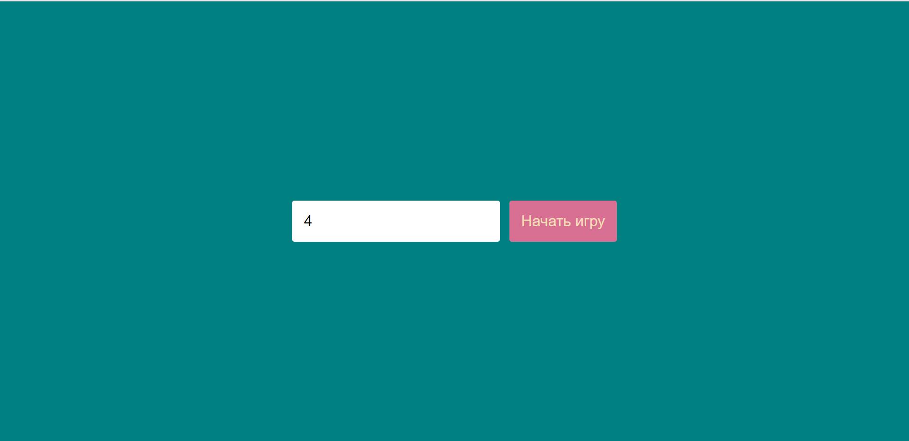
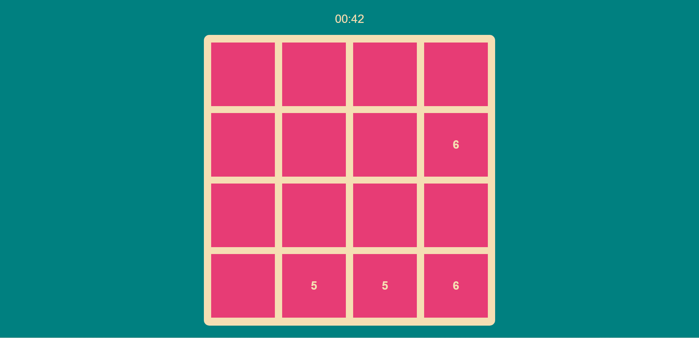
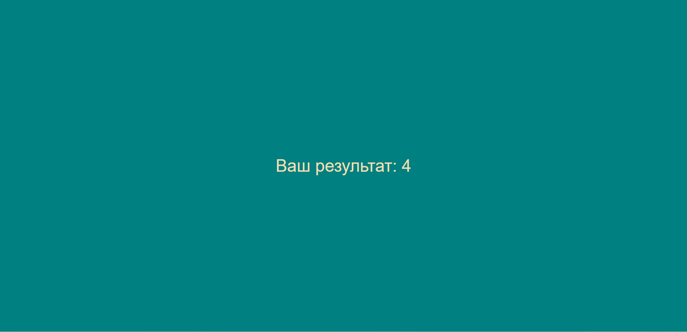
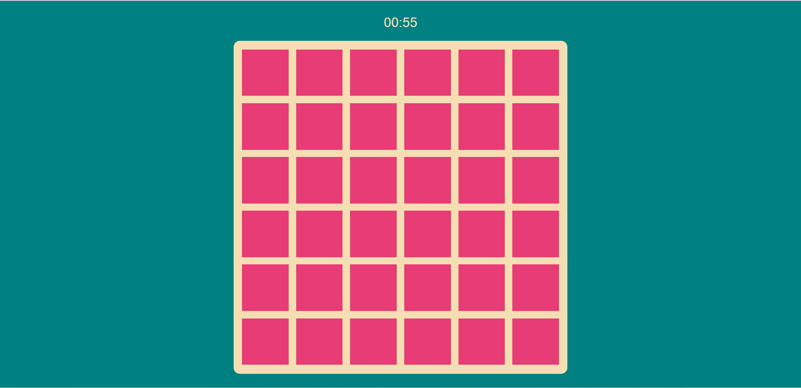
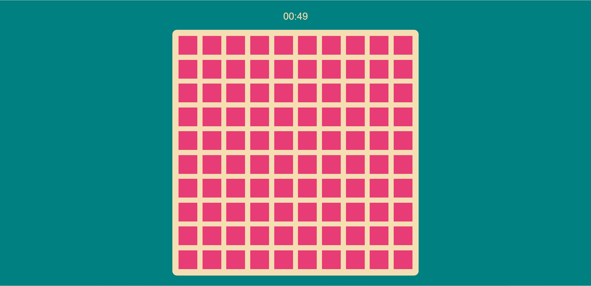

# Pairs-game
A memory-training game. You can set the number of cards (in a row or in a column) than try to open all the pairs of indentical cards.

## Deployment
Download the project and open **index.html** in any browser

### Start view
Enter an even number of tiles you would like to remember (from 2 to 10). The app will render "NUM x NUM" size board (e.g 10 x 10)

### Game view
Click any tile and "turn it over" to see the number, remember it and find a pair card

### Result view
See the overall result

### Various views depending on the entered num of tiles

6 by 6 board view

10 by 10 board view

